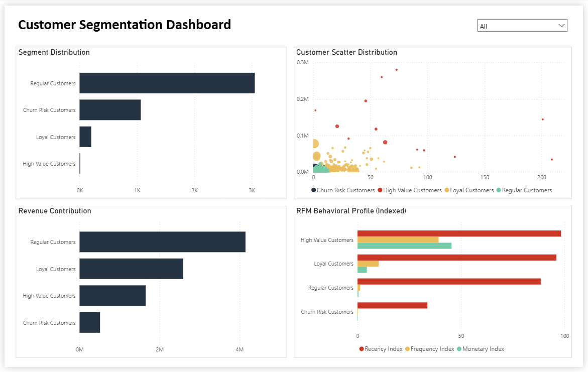

# Customer Segmentation using RFM Analysis and Clustering

## 📌 Project Overview
This project aims to segment customers based on their purchasing behavior using **RFM (Recency, Frequency, Monetary) analysis** and **K-Means clustering**.  
The goal is to generate actionable customer segments that can support marketing, retention, and revenue optimization strategies.

---

## 🎯 Business Problem
Businesses often struggle to understand which customers drive the most value and which are at risk of churn.  
This project answers the question:

> **How can customers be segmented based on transactional behavior to support data-driven business decisions?**

---

## 🧠 Analytical Approach
1. Data cleaning and preprocessing
2. Feature engineering using RFM metrics
3. Customer segmentation using K-Means clustering
4. Business interpretation and segment labeling
5. Visualization and storytelling using Power BI

---

## 🧪 Dataset
- [Retail Transactions: Online Sales Dataset (Year 2010-2011)](https://www.kaggle.com/datasets/shashanks1202/retail-transactions-online-sales-dataset)
- Transaction-level data including invoice date, quantity, unit price, and customer ID

---

## 📊 Customer Segments Identified
- **High Value Customers**  
  Customers with high purchase frequency, high monetary value, and recent activity.

- **Loyal Customers**  
  Customers with consistent purchasing behavior and medium-to-high spending.

- **Regular Customers**  
  Majority of customers contributing revenue through volume.

- **Churn Risk Customers**  
  Customers with low engagement and long inactivity periods.

---

## 📈 Key Insights
- A small number of customers contribute disproportionately high revenue.
- Most revenue volume comes from regular customers due to scale.
- High Value and Loyal customers require retention-focused strategies.
- Churn Risk customers should be targeted with cost-efficient re-engagement campaigns.

---

## 🚀 Business Recommendations
- **High Value Customers:** Priority service, exclusive offers, retention programs  
- **Loyal Customers:** Upselling and cross-selling opportunities  
- **Regular Customers:** Engagement campaigns to increase loyalty  
- **Churn Risk Customers:** Limited reactivation strategies to control cost  

---

## 🛠 Tools & Technologies
- Python (Pandas, Scikit-learn)
- Google Colab
- Power BI
- DAX (Indexed RFM Metrics)

---

## 📁 Project Structure
```
customer-segmentation-rfm/
├── dashboard/
│ ├── customer_segmentation_dashboard.pbix
│ └── dashboard_screenshot.png
├── data/
│ ├── processed/
│ │ └── rfm_segmented.csv
│ └── raw/
│ └── source.txt
├── notebooks/
│ └── customer_segmentation_rfm.ipynb
├── report/
│ └── Customer_Segmentation_using_RFM_Analysis.pdf
└── README.md
```

---

## 📌 Dashboard Preview


---

## 👤 Author
Mario Suryowisnu Wicaksono
Data Analyst | Tech Enthusiast

**LinkedIn:** *www.linkedin.com/in/marioswicaksono*

**CV:** *[marioswicaksono](https://www.canva.com/design/DAGlhKwckaQ/vjIw_6NJgrAEq4hVCdpEUw/view?utm_content=DAGlhKwckaQ&utm_campaign=designshare&utm_medium=link2&utm_source=uniquelinks&utlId=h9dd2c26e9d)*

**Portfolio:** *[marioswicaksono](https://marioswicaksono.my.canva.site/)*
